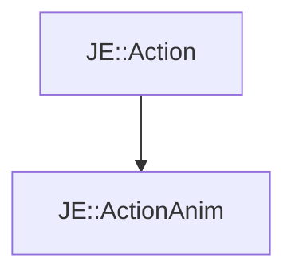

# JE::ActionAnim

[Return to `je`](/docs/je.md)

## C++

- [`ActionAnim.hpp`](/src/je/ActionAnim.hpp)
- [`ActionAnim.cpp`](/src/je/ActionAnim.cpp)

## References

- [`JE::Action`](/docs/je/Action.md)

## Inheritance

[Return to `je`](/docs/je.md)