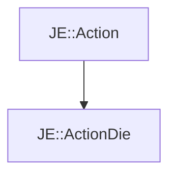

# JE::ActionDie

[Return to `JE`](/docs/je.md)

## C++

- [`ActionDie.hpp`](/src/je/ActionDie.hpp)
- [`ActionDie.cpp`](/src/je/ActionDie.cpp)

## References

- [`JE::Action`](/docs/je/Action.md)

## Inheritance

[Return to `JE`](/docs/je.md)