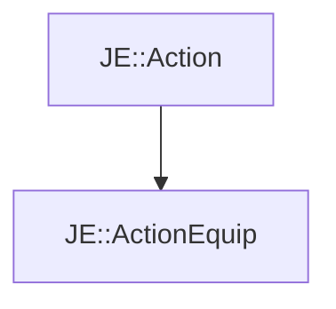

# JE::ActionEquip

[Return to `JE`](/docs/je.md)

## C++

- [`ActionEquip.hpp`](/src/je/ActionEquip.hpp)
- [`ActionEquip.cpp`](/src/je/ActionEquip.cpp)

## References

- [`JE::Action`](/docs/je/Action.md)

## Inheritance

[Return to `JE`](/docs/je.md)