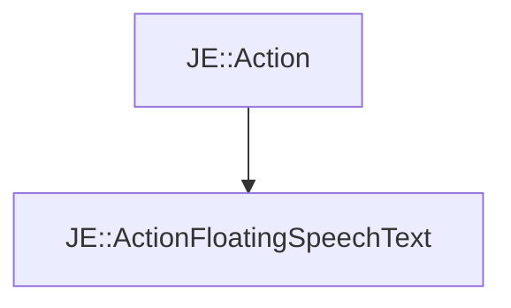

# JE::ActionFloatingSpeechText

[Return to `je`](/docs/je.md)

## C++

- [`ActionFloatingSpeechText.hpp`](/src/je/ActionFloatingSpeechText.hpp)
- [`ActionFloatingSpeechText.cpp`](/src/je/ActionFloatingSpeechText.cpp)

## References

- [`JE::Action`](/docs/je/Action.md)

## Inheritance

[Return to `je`](/docs/je.md)