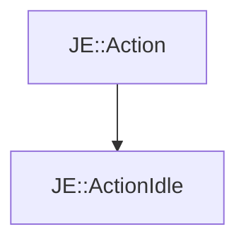

# JE::ActionIdle

[Return to `JE`](/docs/je.md)

## C++

- [`ActionIdle.hpp`](/src/je/ActionIdle.hpp)
- [`ActionIdle.cpp`](/src/je/ActionIdle.cpp)

## References

- [`JE::Action`](/docs/je/Action.md)

## Inheritance

[Return to `JE`](/docs/je.md)