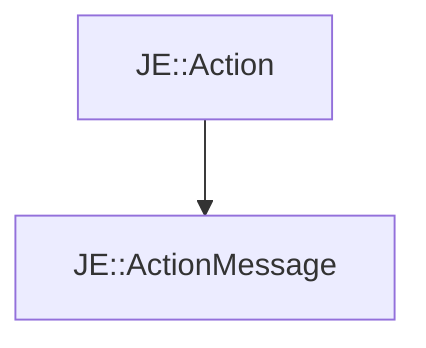

# JE::ActionMessage

[Return to `je`](/docs/je.md)

## C++

- [`ActionMessage.hpp`](/src/je/ActionMessage.hpp)
- [`ActionMessage.cpp`](/src/je/ActionMessage.cpp)

## References

- [`JE::Action`](/docs/je/Action.md)

## Inheritance

[Return to `je`](/docs/je.md)