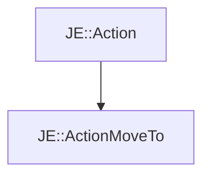

# JE::ActionMoveTo

[Return to `je`](/docs/je.md)

## C++

- [`ActionMoveTo.hpp`](/src/je/ActionMoveTo.hpp)
- [`ActionMoveTo.cpp`](/src/je/ActionMoveTo.cpp)

## References

- [`JE::Action`](/docs/je/Action.md)

## Inheritance

[Return to `je`](/docs/je.md)