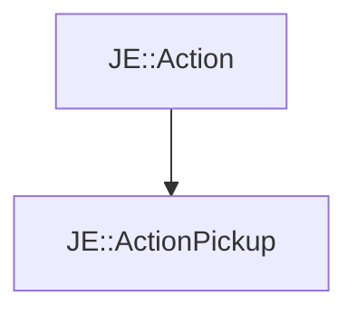

# JE::ActionPickup

[Return to `je`](/docs/je.md)

## C++

- [`ActionPickup.hpp`](/src/je/ActionPickup.hpp)
- [`ActionPickup.cpp`](/src/je/ActionPickup.cpp)

## References

- [`JE::Action`](/docs/je/Action.md)

## Inheritance

[Return to `je`](/docs/je.md)