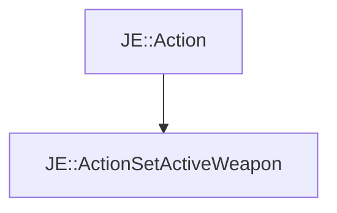

# JE::ActionSetActiveWeapon

[Return to `je`](/docs/je.md)

## C++

- [`ActionSetActiveWeapon.hpp`](/src/je/ActionSetActiveWeapon.hpp)
- [`ActionSetActiveWeapon.cpp`](/src/je/ActionSetActiveWeapon.cpp)

## References

- [`JE::Action`](/docs/je/Action.md)

## Inheritance

[Return to `je`](/docs/je.md)