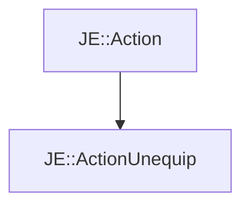

# JE::ActionUnequip

[Return to `je`](/docs/je.md)

## C++

- [`ActionUnequip.hpp`](/src/je/ActionUnequip.hpp)
- [`ActionUnequip.cpp`](/src/je/ActionUnequip.cpp)

## References

- [`JE::Action`](/docs/je/Action.md)

## Inheritance

[Return to `je`](/docs/je.md)