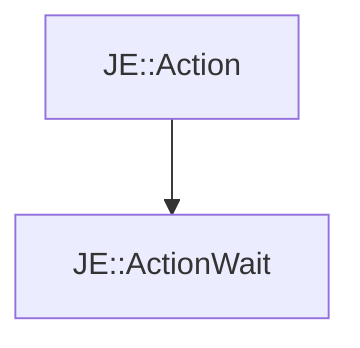

# JE::ActionWait

[Return to `JE`](/docs/je.md)

## C++

- [`ActionWait.hpp`](/src/je/ActionWait.hpp)
- [`ActionWait.cpp`](/src/je/ActionWait.cpp)

## References

- [`JE::Action`](/docs/je/Action.md)

## Inheritance

[Return to `JE`](/docs/je.md)