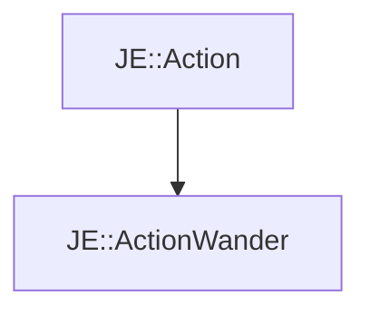

# JE::ActionWander

[Return to `je`](/docs/je.md)

## C++

- [`ActionWander.hpp`](/src/je/ActionWander.hpp)
- [`ActionWander.cpp`](/src/je/ActionWander.cpp)

## References

- [`JE::Action`](/docs/je/Action.md)

## Inheritance

[Return to `je`](/docs/je.md)