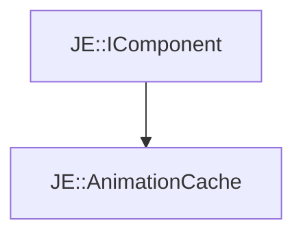

# JE::AnimationCache

[Return to `JE`](/docs/je.md)

## C++

- [`AnimationCache.hpp`](/src/je/AnimationCache.hpp)
- [`AnimationCache.cpp`](/src/je/AnimationCache.cpp)

## References

- [`JE::IComponent`](/docs/je/IComponent.md)

## Inheritance

[Return to `JE`](/docs/je.md)