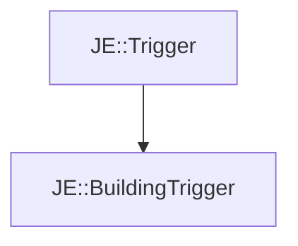

# JE::BuildingTrigger

[Return to `JE`](/docs/je.md)

## C++

- [`BuildingTrigger.hpp`](/src/je/BuildingTrigger.hpp)
- [`BuildingTrigger.cpp`](/src/je/BuildingTrigger.cpp)

## References

- [`JE::Trigger`](/docs/je/Trigger.md)

## Inheritance

[Return to `JE`](/docs/je.md)