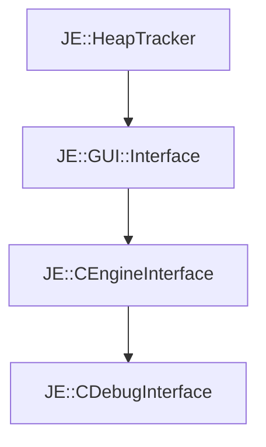

# JE::CDebugInterface

[Return to `JE`](/docs/je.md)

## C++

- [`CDebugInterface.hpp`](/src/je/CDebugInterface.hpp)
- [`CDebugInterface.cpp`](/src/je/CDebugInterface.cpp)

## References

- [`JE::HeapTracker`](/docs/je/HeapTracker.md)
- [`JE::GUI::Interface`](/docs/je/GUI/Interface.md)
- [`JE::CEngineInterface`](/docs/je/CEngineInterface.md)

## Inheritance

[Return to `JE`](/docs/je.md)