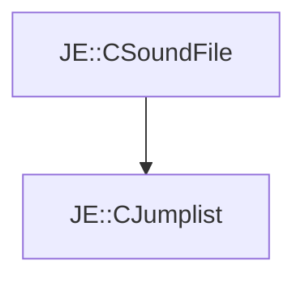

# JE::CJumplist

[Return to `je`](/docs/je.md)

## C++

- [`CJumplist.hpp`](/src/je/CJumplist.hpp)
- [`CJumplist.cpp`](/src/je/CJumplist.cpp)

## References

- [`JE::CSoundFile`](/docs/je/CSoundFile.md)

## Inheritance

[Return to `je`](/docs/je.md)