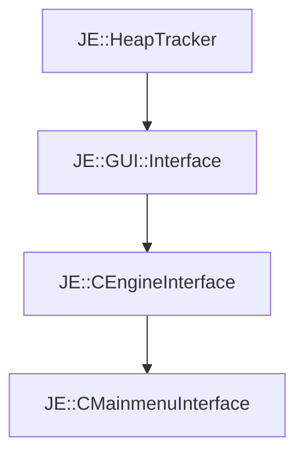

# JE::CMainmenuInterface

[Return to `je`](/docs/je.md)

## C++

- [`CMainmenuInterface.hpp`](/src/je/CMainmenuInterface.hpp)
- [`CMainmenuInterface.cpp`](/src/je/CMainmenuInterface.cpp)

## References

- [`JE::HeapTracker`](/docs/je/HeapTracker.md)
- [`JE::GUI::Interface`](/docs/je/GUI/Interface.md)
- [`JE::CEngineInterface`](/docs/je/CEngineInterface.md)

## Inheritance

[Return to `je`](/docs/je.md)