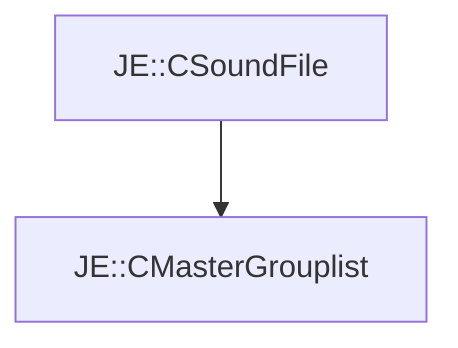

# JE::CMasterGrouplist

[Return to `je`](/docs/je.md)

## C++

- [`CMasterGrouplist.hpp`](/src/je/CMasterGrouplist.hpp)
- [`CMasterGrouplist.cpp`](/src/je/CMasterGrouplist.cpp)

## References

- [`JE::CSoundFile`](/docs/je/CSoundFile.md)

## Inheritance

[Return to `je`](/docs/je.md)