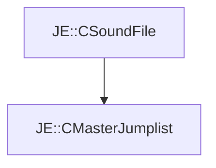

# JE::CMasterJumplist

[Return to `JE`](/docs/je.md)

## C++

- [`CMasterJumplist.hpp`](/src/je/CMasterJumplist.hpp)
- [`CMasterJumplist.cpp`](/src/je/CMasterJumplist.cpp)

## References

- [`JE::CSoundFile`](/docs/je/CSoundFile.md)

## Inheritance

[Return to `JE`](/docs/je.md)