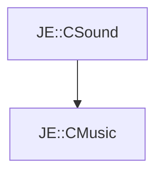

# JE::CMusic

[Return to `JE`](/docs/je.md)

## C++

- [`CMusic.hpp`](/src/je/CMusic.hpp)
- [`CMusic.cpp`](/src/je/CMusic.cpp)

## References

- [`JE::CSound`](/docs/je/CSound.md)

## Inheritance

[Return to `JE`](/docs/je.md)