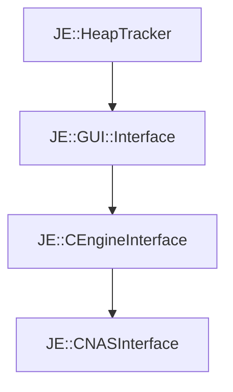

# JE::CNASInterface

[Return to `JE`](/docs/je.md)

## C++

- [`CNASInterface.hpp`](/src/je/CNASInterface.hpp)
- [`CNASInterface.cpp`](/src/je/CNASInterface.cpp)

## References

- [`JE::HeapTracker`](/docs/je/HeapTracker.md)
- [`JE::GUI::Interface`](/docs/je/GUI/Interface.md)
- [`JE::CEngineInterface`](/docs/je/CEngineInterface.md)

## Inheritance

[Return to `JE`](/docs/je.md)