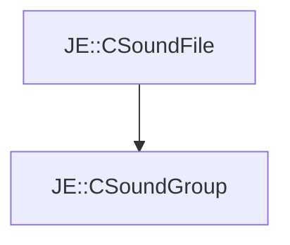

# JE::CSoundGroup

[Return to `je`](/docs/je.md)

## C++

- [`CSoundGroup.hpp`](/src/je/CSoundGroup.hpp)
- [`CSoundGroup.cpp`](/src/je/CSoundGroup.cpp)

## References

- [`JE::CSoundFile`](/docs/je/CSoundFile.md)

## Inheritance

[Return to `je`](/docs/je.md)