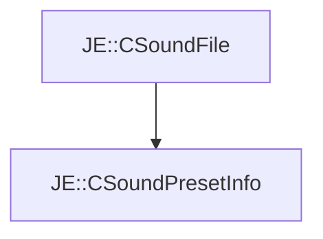

# JE::CSoundPresetInfo

[Return to `JE`](/docs/je.md)

## C++

- [`CSoundPresetInfo.hpp`](/src/je/CSoundPresetInfo.hpp)
- [`CSoundPresetInfo.cpp`](/src/je/CSoundPresetInfo.cpp)

## References

- [`JE::CSoundFile`](/docs/je/CSoundFile.md)

## Inheritance

[Return to `JE`](/docs/je.md)