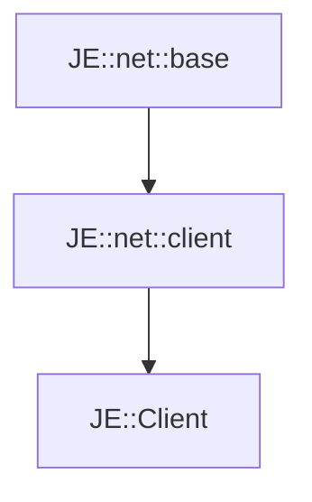

# JE::Client

[Return to `je`](/docs/je.md)

## C++

- [`Client.hpp`](/src/je/Client.hpp)
- [`Client.cpp`](/src/je/Client.cpp)

## References

- [`JE::net::base`](/docs/net/base.md)
- [`JE::net::client`](/docs/net/client.md)

## Inheritance

[Return to `je`](/docs/je.md)