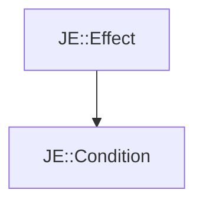

# JE::Condition

[Return to `JE`](/docs/je.md)

## C++

- [`Condition.hpp`](/src/je/Condition.hpp)
- [`Condition.cpp`](/src/je/Condition.cpp)

## References

- [`JE::Effect`](/docs/je/Effect.md)

## Inheritance

[Return to `JE`](/docs/je.md)