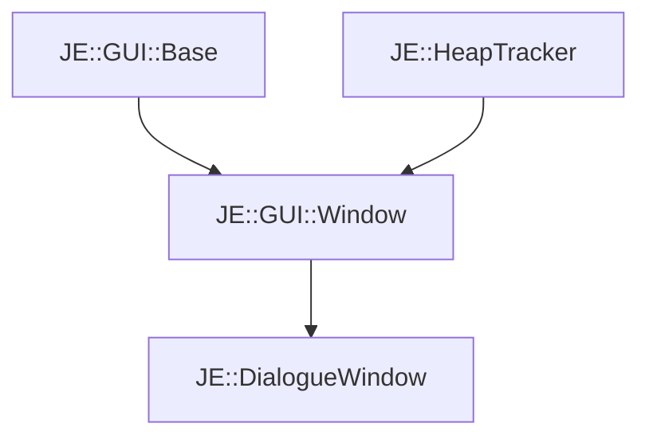

# JE::DialogueWindow

[Return to `je`](/docs/je.md)

## C++

- [`DialogueWindow.hpp`](/src/je/DialogueWindow.hpp)
- [`DialogueWindow.cpp`](/src/je/DialogueWindow.cpp)

## References

- [`JE::GUI::Base`](/docs/je/GUI/Base.md)
- [`JE::HeapTracker`](/docs/je/HeapTracker.md)
- [`JE::GUI::Window`](/docs/je/GUI/Window.md)

## Inheritance

[Return to `je`](/docs/je.md)