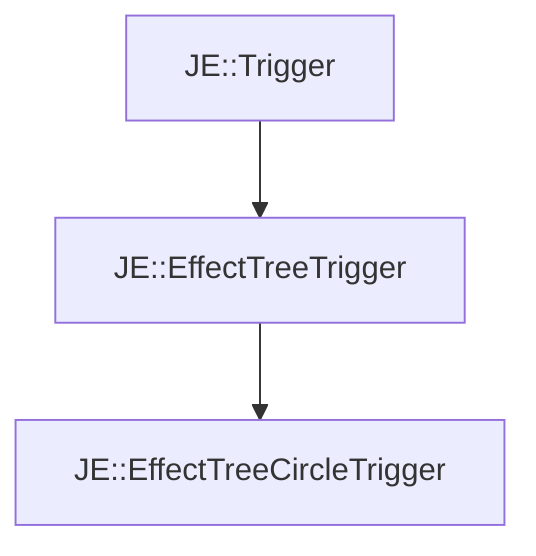

# JE::EffectTreeCircleTrigger

[Return to `JE`](/docs/je.md)

## C++

- [`EffectTreeCircleTrigger.hpp`](/src/je/EffectTreeCircleTrigger.hpp)
- [`EffectTreeCircleTrigger.cpp`](/src/je/EffectTreeCircleTrigger.cpp)

## References

- [`JE::Trigger`](/docs/je/Trigger.md)
- [`JE::EffectTreeTrigger`](/docs/je/EffectTreeTrigger.md)

## Inheritance

[Return to `JE`](/docs/je.md)