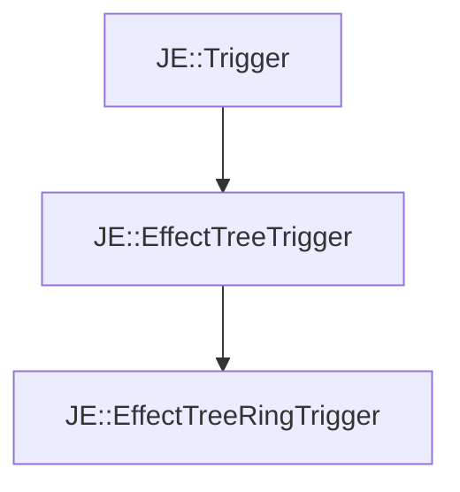

# JE::EffectTreeRingTrigger

[Return to `je`](/docs/je.md)

## C++

- [`EffectTreeRingTrigger.hpp`](/src/je/EffectTreeRingTrigger.hpp)
- [`EffectTreeRingTrigger.cpp`](/src/je/EffectTreeRingTrigger.cpp)

## References

- [`JE::Trigger`](/docs/je/Trigger.md)
- [`JE::EffectTreeTrigger`](/docs/je/EffectTreeTrigger.md)

## Inheritance

[Return to `je`](/docs/je.md)