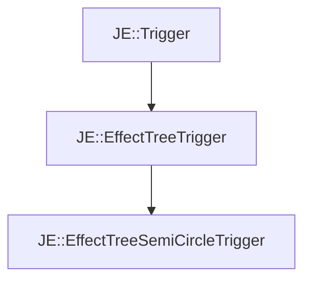

# JE::EffectTreeSemiCircleTrigger

[Return to `je`](/docs/je.md)

## C++

- [`EffectTreeSemiCircleTrigger.hpp`](/src/je/EffectTreeSemiCircleTrigger.hpp)
- [`EffectTreeSemiCircleTrigger.cpp`](/src/je/EffectTreeSemiCircleTrigger.cpp)

## References

- [`JE::Trigger`](/docs/je/Trigger.md)
- [`JE::EffectTreeTrigger`](/docs/je/EffectTreeTrigger.md)

## Inheritance

[Return to `je`](/docs/je.md)