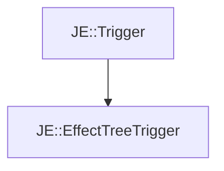

# JE::EffectTreeTrigger

[Return to `JE`](/docs/je.md)

## C++

- [`EffectTreeTrigger.hpp`](/src/je/EffectTreeTrigger.hpp)
- [`EffectTreeTrigger.cpp`](/src/je/EffectTreeTrigger.cpp)

## References

- [`JE::Trigger`](/docs/je/Trigger.md)

## Inheritance

[Return to `JE`](/docs/je.md)