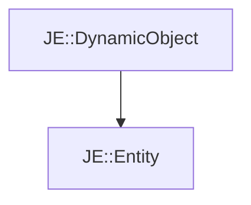

# JE::Entity

[Return to `JE`](/docs/je.md)

## C++

- [`Entity.hpp`](/src/je/Entity.hpp)
- [`Entity.cpp`](/src/je/Entity.cpp)

## References

- [`JE::DynamicObject`](/docs/je/DynamicObject.md)

## Inheritance

[Return to `JE`](/docs/je.md)