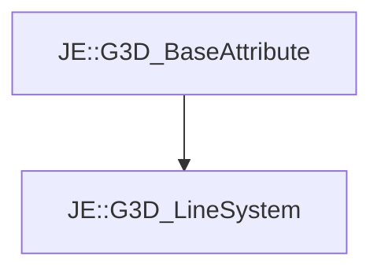

# JE::G3D_LineSystem

[Return to `je`](/docs/je.md)

## C++

- [`G3D_LineSystem.hpp`](/src/je/G3D_LineSystem.hpp)
- [`G3D_LineSystem.cpp`](/src/je/G3D_LineSystem.cpp)

## References

- [`JE::G3D_BaseAttribute`](/docs/je/G3D_BaseAttribute.md)

## Inheritance

[Return to `je`](/docs/je.md)