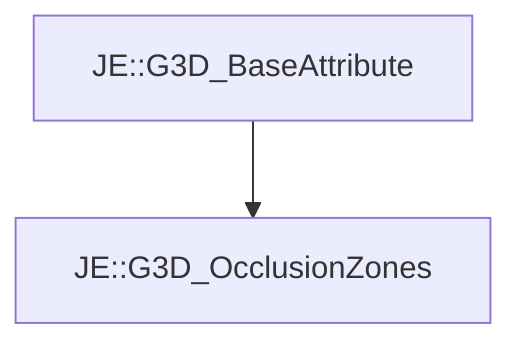

# JE::G3D_OcclusionZones

[Return to `JE`](/docs/je.md)

## C++

- [`G3D_OcclusionZones.hpp`](/src/je/G3D_OcclusionZones.hpp)
- [`G3D_OcclusionZones.cpp`](/src/je/G3D_OcclusionZones.cpp)

## References

- [`JE::G3D_BaseAttribute`](/docs/je/G3D_BaseAttribute.md)

## Inheritance

[Return to `JE`](/docs/je.md)