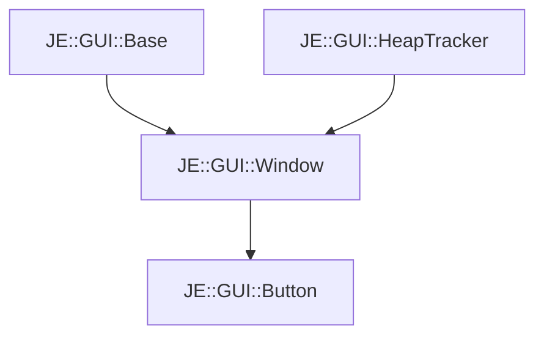

# JE::GUI::Button

[Return to `JE`](/docs/je.md)

## C++

- [`Button.hpp`](/src/je/Button.hpp)
- [`Button.cpp`](/src/je/Button.cpp)

## Inheritance

```mermaid
graph TD;
    JE::GUI::Base-->JE::GUI::Window
    JE::GUI::HeapTracker-->JE::GUI::Window
    JE::GUI::Window-->JE::GUI::Button
```

[Return to `JE`](/docs/je.md)