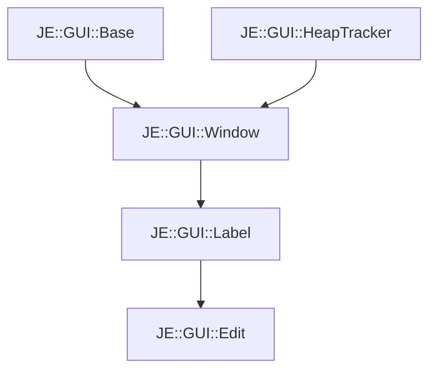

# JE::GUI::Edit

[Return to `je`](/docs/je.md)

## C++

- [`Edit.hpp`](/src/je/Edit.hpp)
- [`Edit.cpp`](/src/je/Edit.cpp)

## Inheritance

```mermaid
graph TD;
    JE::GUI::Base-->JE::GUI::Window
    JE::GUI::HeapTracker-->JE::GUI::Window
    JE::GUI::Window-->JE::GUI::Label-->JE::GUI::Edit
```

[Return to `je`](/docs/je.md)