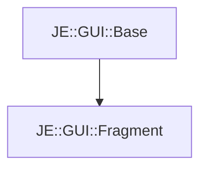

# JE::GUI::Fragment

[Return to `je`](/docs/je.md)

## C++

- [`Fragment.hpp`](/src/je/Fragment.hpp)
- [`Fragment.cpp`](/src/je/Fragment.cpp)

## Inheritance

```mermaid
graph TD;
    JE::GUI::Base-->JE::GUI::Fragment
```

[Return to `je`](/docs/je.md)