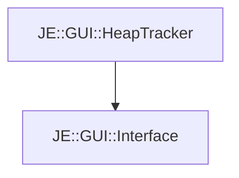

# JE::GUI::Interface

[Return to `JE`](/docs/je.md)

## C++

- [`Interface.hpp`](/src/je/Interface.hpp)
- [`Interface.cpp`](/src/je/Interface.cpp)

## Inheritance

```mermaid
graph TD;
    JE::GUI::HeapTracker-->JE::GUI::Interface
```

[Return to `JE`](/docs/je.md)