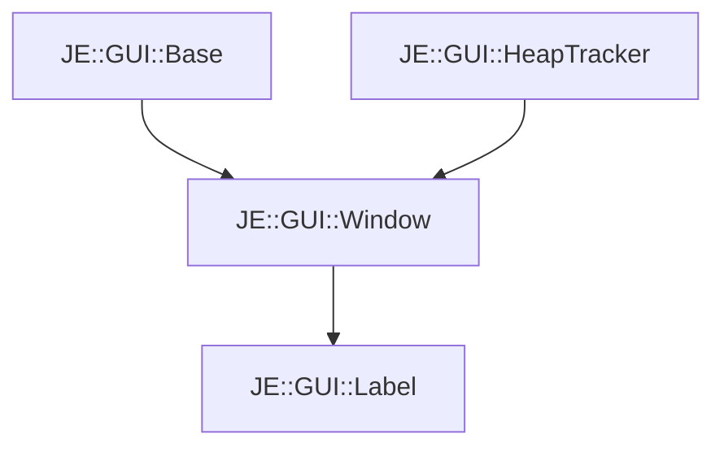

# JE::GUI::Label

[Return to `JE`](/docs/je.md)

## C++

- [`Label.hpp`](/src/je/Label.hpp)
- [`Label.cpp`](/src/je/Label.cpp)

## Inheritance

```mermaid
graph TD;
    JE::GUI::Base-->JE::GUI::Window
    JE::GUI::HeapTracker-->JE::GUI::Window
    JE::GUI::Window-->JE::GUI::Label
```

[Return to `JE`](/docs/je.md)