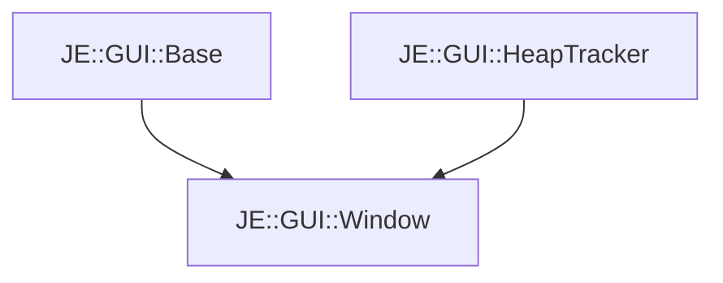

# JE::GUI::Window

[Return to `JE`](/docs/je.md)

## C++

- [`Window.hpp`](/src/je/Window.hpp)
- [`Window.cpp`](/src/je/Window.cpp)

## Inheritance

```mermaid
graph TD;
    JE::GUI::Base-->JE::GUI::Window
    JE::GUI::HeapTracker-->JE::GUI::Window
```

[Return to `JE`](/docs/je.md)