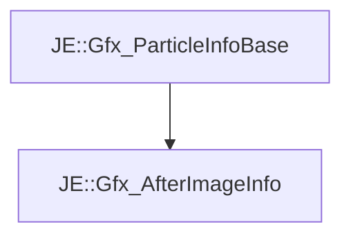

# JE::Gfx_AfterImageInfo

[Return to `JE`](/docs/je.md)

## C++

- [`Gfx_AfterImageInfo.hpp`](/src/je/Gfx_AfterImageInfo.hpp)
- [`Gfx_AfterImageInfo.cpp`](/src/je/Gfx_AfterImageInfo.cpp)

## References

- [`JE::Gfx_ParticleInfoBase`](/docs/je/Gfx_ParticleInfoBase.md)

## Inheritance

[Return to `JE`](/docs/je.md)