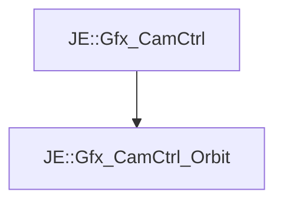

# JE::Gfx_CamCtrl_Orbit

[Return to `je`](/docs/je.md)

## C++

- [`Gfx_CamCtrl_Orbit.hpp`](/src/je/Gfx_CamCtrl_Orbit.hpp)
- [`Gfx_CamCtrl_Orbit.cpp`](/src/je/Gfx_CamCtrl_Orbit.cpp)

## References

- [`JE::Gfx_CamCtrl`](/docs/je/Gfx_CamCtrl.md)

## Inheritance

[Return to `je`](/docs/je.md)