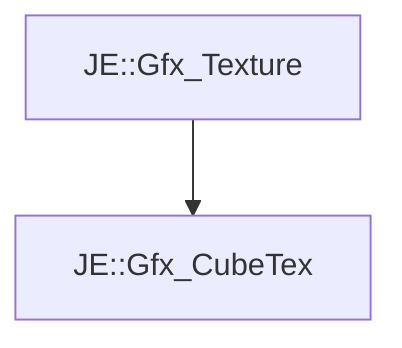

# JE::Gfx_CubeTex

[Return to `JE`](/docs/je.md)

## C++

- [`Gfx_CubeTex.hpp`](/src/je/Gfx_CubeTex.hpp)
- [`Gfx_CubeTex.cpp`](/src/je/Gfx_CubeTex.cpp)

## References

- [`JE::Gfx_Texture`](/docs/je/Gfx_Texture.md)

## Inheritance

[Return to `JE`](/docs/je.md)