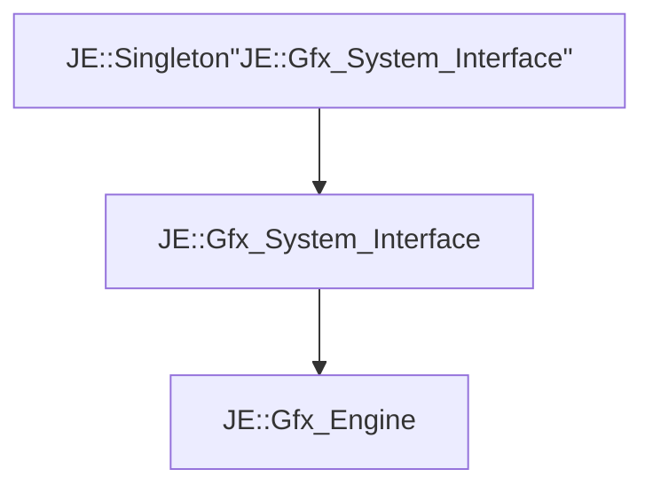

# JE::Gfx_Engine

[Return to `JE`](/docs/je.md)

## C++

- [`Gfx_Engine.hpp`](/src/je/Gfx_Engine.hpp)
- [`Gfx_Engine.cpp`](/src/je/Gfx_Engine.cpp)

## References

- [`JE::Singleton`](/docs/je/Singleton.md)
- [`JE::Gfx_System_Interface`](/docs/je/Gfx_System_Interface.md)

## Inheritance

[Return to `JE`](/docs/je.md)