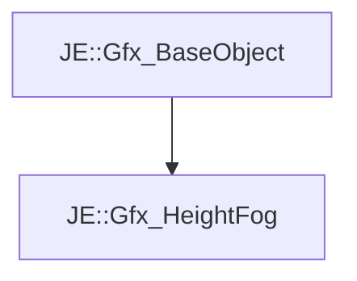

# JE::Gfx_HeightFog

[Return to `JE`](/docs/je.md)

## C++

- [`Gfx_HeightFog.hpp`](/src/je/Gfx_HeightFog.hpp)
- [`Gfx_HeightFog.cpp`](/src/je/Gfx_HeightFog.cpp)

## References

- [`JE::Gfx_BaseObject`](/docs/je/Gfx_BaseObject.md)

## Inheritance

[Return to `JE`](/docs/je.md)