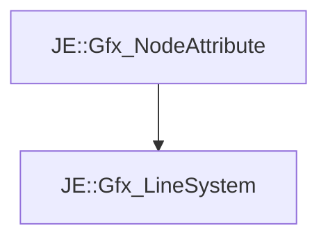

# JE::Gfx_LineSystem

[Return to `je`](/docs/je.md)

## C++

- [`Gfx_LineSystem.hpp`](/src/je/Gfx_LineSystem.hpp)
- [`Gfx_LineSystem.cpp`](/src/je/Gfx_LineSystem.cpp)

## References

- [`JE::Gfx_NodeAttribute`](/docs/je/Gfx_NodeAttribute.md)

## Inheritance

[Return to `je`](/docs/je.md)