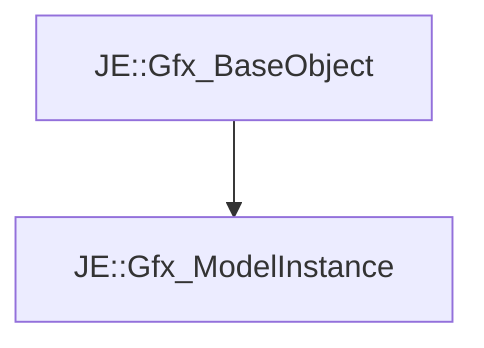

# JE::Gfx_ModelInstance

[Return to `je`](/docs/je.md)

## C++

- [`Gfx_ModelInstance.hpp`](/src/je/Gfx_ModelInstance.hpp)
- [`Gfx_ModelInstance.cpp`](/src/je/Gfx_ModelInstance.cpp)

## References

- [`JE::Gfx_BaseObject`](/docs/je/Gfx_BaseObject.md)

## Inheritance

[Return to `je`](/docs/je.md)