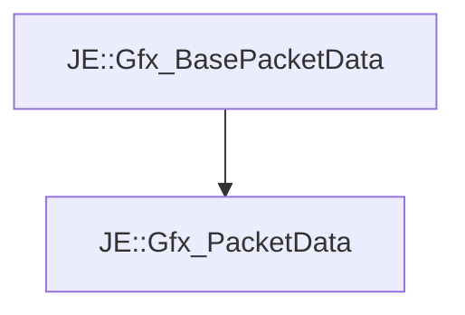

# JE::Gfx_PacketData

[Return to `JE`](/docs/je.md)

## C++

- [`Gfx_PacketData.hpp`](/src/je/Gfx_PacketData.hpp)
- [`Gfx_PacketData.cpp`](/src/je/Gfx_PacketData.cpp)

## References

- [`JE::Gfx_BasePacketData`](/docs/je/Gfx_BasePacketData.md)

## Inheritance

[Return to `JE`](/docs/je.md)