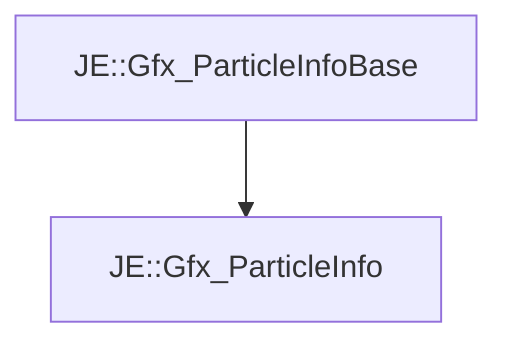

# JE::Gfx_ParticleInfo

[Return to `je`](/docs/je.md)

## C++

- [`Gfx_ParticleInfo.hpp`](/src/je/Gfx_ParticleInfo.hpp)
- [`Gfx_ParticleInfo.cpp`](/src/je/Gfx_ParticleInfo.cpp)

## References

- [`JE::Gfx_ParticleInfoBase`](/docs/je/Gfx_ParticleInfoBase.md)

## Inheritance

[Return to `je`](/docs/je.md)