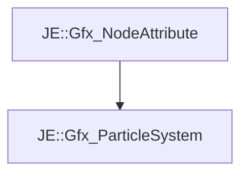

# JE::Gfx_ParticleSystem

[Return to `je`](/docs/je.md)

## C++

- [`Gfx_ParticleSystem.hpp`](/src/je/Gfx_ParticleSystem.hpp)
- [`Gfx_ParticleSystem.cpp`](/src/je/Gfx_ParticleSystem.cpp)

## References

- [`JE::Gfx_NodeAttribute`](/docs/je/Gfx_NodeAttribute.md)

## Inheritance

[Return to `je`](/docs/je.md)