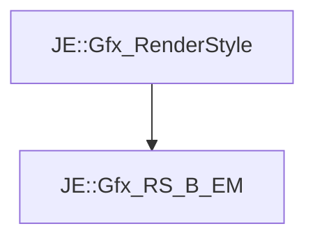

# JE::Gfx_RS_B_EM

[Return to `JE`](/docs/je.md)

## C++

- [`Gfx_RS_B_EM.hpp`](/src/je/Gfx_RS_B_EM.hpp)
- [`Gfx_RS_B_EM.cpp`](/src/je/Gfx_RS_B_EM.cpp)

## References

- [`JE::Gfx_RenderStyle`](/docs/je/Gfx_RenderStyle.md)

## Inheritance

[Return to `JE`](/docs/je.md)